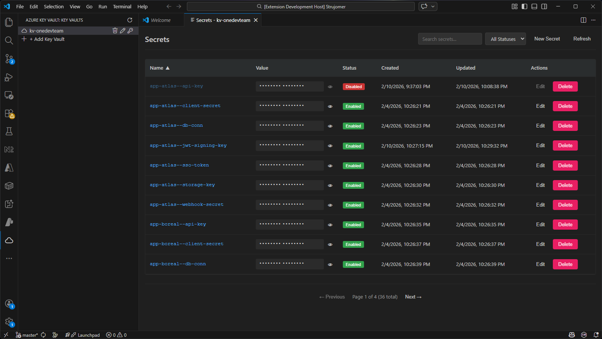

# One Key Vault UI

Azure Key Vault explorer extension for VS Code with inline secret editing capabilities.



## Features

- 🔐 **Connect to Azure Key Vaults** - Add and manage multiple Key Vaults
- 📋 **Browse and list secrets** - View all secrets in a vault
- 🔍 **Search and filter secrets** - Find secrets quickly
- 📊 **Pagination and sorting** - Navigate through secrets with sorting options
- ✏️ **Inline secret editing** - Edit secret values directly
- 🗑️ **Delete secrets** - Remove secrets from the vault
- 👁️ **Toggle secret visibility** - Reveal/hide secret values for security

## Usage

### Adding a Key Vault

1. Click the cloud icon in the Activity Bar (left sidebar) to open the Azure Key Vault explorer
2. Click the **"+ Add Key Vault"** button in the tree view
3. Enter your Key Vault URL in the format: `https://<vault-name>.vault.azure.net/`
4. Enter a friendly name for the vault
5. Click Enter to confirm

Example:

- URL: `https://myvault.vault.azure.net/`
- Name: `Production Vault`

### Viewing Secrets

1. Click on a Key Vault in the tree view to open the secrets editor
2. The secrets will be displayed in a table with:
   - **Name**: Secret name
   - **Value**: Secret value (masked by default)
   - **Status**: Enabled/Disabled badge
   - **Updated**: Last update timestamp
   - **Actions**: Edit and Delete buttons

### Searching Secrets

1. In the secrets view, type in the search box to filter secrets by name
2. Search is real-time and case-insensitive

### Sorting Secrets

1. Click on column headers to sort:
   - **Name**: Alphabetical order
   - **Created**: By creation date
   - **Updated**: By modification date
2. Click again to reverse sort direction (ascending/descending)

### Revealing Secret Values

1. Click the eye icon (👁️) next to a secret to reveal its value
2. Click again to hide the value
3. Values are masked by default for security

### Editing Secrets

1. Click the **Edit** button next to a secret
2. Enter the new value in the prompt dialog
3. Click OK to confirm
4. The secret will be updated in the Key Vault

### Deleting Secrets

1. Click the **Delete** button next to a secret
2. Confirm the deletion in the prompt
3. The secret will be permanently removed from the Key Vault

### Pagination

- Secrets are displayed 10 per page by default
- Use the **Previous** and **Next** buttons to navigate
- The page indicator shows current page and total secret count

### Removing a Key Vault

1. Right-click on a Key Vault in the tree view
2. Click **Remove Key Vault**
3. Confirm the removal
4. The vault will be removed from the extension (not from Azure)

## Authentication

The first time you open a Key Vault in a session, the extension prompts you to choose an authentication method. This prompt appears once per VS Code session — subsequent vault opens skip the prompt until VS Code is restarted or credentials are cleared.

### Option 1: Sign in with VS Code

Uses the [Azure Account](https://marketplace.visualstudio.com/items?itemName=ms-vscode.azure-account) extension's active sign-in. Select this option if you are already signed in to Azure in VS Code.

**Requirements:** Azure Account extension installed and signed in.

### Option 2: Sign in with Azure CLI

Opens a terminal and runs `az login` for you. Complete the browser sign-in, then click **Continue** in the dialog to proceed.

**Requirements:** [Azure CLI](https://learn.microsoft.com/cli/azure/install-azure-cli) installed and available on your PATH.

```bash
# Verify Azure CLI is installed
az --version

# Manually sign in (the extension will do this for you)
az login
```

### Option 3: Use a Service Principal

Prompts for Tenant ID, Client ID, and Client Secret. Suitable for automated or non-interactive environments.

- **Tenant ID** and **Client ID** are stored in VS Code secret storage between sessions
- **Client Secret** is held in memory only and never persisted — you will be prompted for it each time a new session starts

Create and grant a service principal with Azure CLI:

```bash
# 1) Create service principal (save appId, password, tenant from output)
az ad sp create-for-rbac --name "<your-keyvault-name>" --skip-assignment

# 2) Set variables from step 1 output + your vault name
APP_ID="<appId>"
TENANT_ID="<tenant>"
CLIENT_SECRET="<password>"
VAULT_NAME="<your-keyvault-name>"

# 3) Resolve SP object ID and Key Vault scope
SP_OBJECT_ID=$(az ad sp show --id "$APP_ID" --query id -o tsv)
SCOPE=$(az keyvault show --name "$VAULT_NAME" --query id -o tsv)

# 4) Assign least-privilege role for secrets operations
az role assignment create \
   --assignee-object-id "$SP_OBJECT_ID" \
   --assignee-principal-type ServicePrincipal \
   --role "Key Vault Secrets Officer" \
   --scope "$SCOPE"
```

Use these values in the extension prompts:

- Tenant ID: `$TENANT_ID`
- Client ID: `$APP_ID`
- Client Secret: `$CLIENT_SECRET`

### Managing Stored Credentials

Each vault in the tree view has two credential management buttons:

| Button                          | Action                                                               |
| ------------------------------- | -------------------------------------------------------------------- |
| ✏️ **Edit Stored Credentials**  | Update the stored Tenant ID and Client ID for service principal auth |
| 🔑 **Clear Stored Credentials** | Remove stored Tenant ID and Client ID, resetting to a clean state    |

Clearing or editing credentials also resets the session authentication, so the login prompt will appear on the next vault open.

## Permissions Required

Your Azure account needs the following permissions on the Key Vault:

- `Microsoft.KeyVault/vaults/read` - List vaults
- `Microsoft.KeyVault/vaults/secrets/read` - View secrets
- `Microsoft.KeyVault/vaults/secrets/write` - Edit secrets
- `Microsoft.KeyVault/vaults/secrets/delete` - Delete secrets

These are typically available with the "Key Vault Administrator" or "Key Vault Secrets Officer" roles.

## Security Notes

⚠️ **Important Security Considerations:**

- Secret values are **masked by default** and only shown when you explicitly click the eye icon
- **Never share** secret values via screenshots, logs, or messages
- Ensure proper RBAC permissions on your Key Vault
- The extension caches secrets in memory for the current session
- Clear browser data periodically to remove any cached values
- Use Strong authentication (MFA recommended)

## Keyboard Shortcuts

- **F5** (in development) - Reload extension
- **Ctrl+Shift+P** - Open Command Palette
  - Search for "Key Vault" to see all available commands
- **Ctrl+K Ctrl+0** - Focus on Explorer
- **Ctrl+Shift+X** - Open Extensions

## Troubleshooting

### Extension doesn't appear in VS Code

- Make sure the `.vsix` file was properly installed
- Reload VS Code (Ctrl+R)
- Check Extensions panel to see if it's installed and enabled

### Login prompt or "Authentication required" error

- The extension will show a login prompt — choose your preferred method (VS Code, Azure CLI, or Service Principal)
- For Azure CLI option: make sure `az` is installed and run `az login` manually to verify it works
- For VS Code option: install and sign in with the [Azure Account](https://marketplace.visualstudio.com/items?itemName=ms-vscode.azure-account) extension
- If a session expires mid-use, the extension will re-prompt automatically

### Can't access Key Vault

- Verify the vault URL format: `https://<vault-name>.vault.azure.net/`
- Check that your Azure account has access to the vault
- Verify firewall/network rules aren't blocking access

### Secrets not loading

- Check the Output panel (View → Output) for error messages
- Select "Extension Host" from the dropdown
- Verify your Azure credentials are valid

### Slow performance

- Check your internet connection
- The extension fetches all secrets when opening a vault
- Large vaults may take longer to load

## Tips & Tricks

1. **Add frequently used vaults** to quickly switch between them
2. **Use meaningful names** for vaults to easily identify them
3. **Sort by "Updated"** to quickly find recently modified secrets
4. **Use search** to find secrets without scrolling through pagination
5. **Refresh** using the button in the title bar if you make changes outside the extension

## Known Limitations

- Currently supports Azure Key Vault's Secrets only (not Keys or Certificates)
- Maximum 10 secrets per page (configurable in future versions)
- Real-time sync not yet implemented - refresh manually if changes are made outside the extension
- Bulk operations not yet supported

## Future Enhancements

Planned features for future versions:

- [ ] Support for Azure Key Vault Keys and Certificates
- [ ] Bulk operations (delete, edit multiple secrets)
- [ ] Real-time secret sync across sessions
- [ ] Secret versioning and history
- [ ] Custom field mapping and tagging
- [ ] Export/Import functionality
- [ ] Scheduled secret rotation alerts
- [ ] Integration with GitHub Secrets

## License

MIT License - see LICENSE file for details

## Support

For issues, bugs, or feature requests, please open an issue on GitHub.
